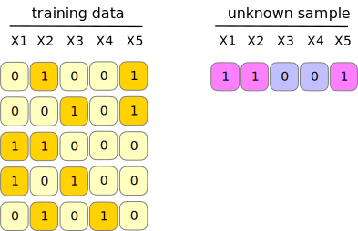
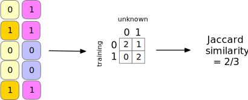

---
output:
  xaringan::moon_reader:
    css: ["mtheme_max.css", "fonts_mtheme_max.css"]  
    self_contained: false
    lib_dir: libs
    nature:
      ratio: '16:9'
      highlightLanguage: R
      countIncrementalSlides: false   
---

```{r startup, include = FALSE, message = FALSE, warning = FALSE}
library(tidymodels)
library(applicable)
library(QSARdata)
data(MeltingPoint)
thm <- theme_bw() +
  theme(
    panel.background = element_rect(fill = "transparent", colour = NA),
    plot.background = element_rect(fill = "transparent", colour = NA),
    legend.position = "top",
    legend.background = element_rect(fill = "transparent", colour = NA),
    legend.key = element_rect(fill = "transparent", colour = NA)
  )
theme_set(thm)

library(knitr)
options(width = 110)

opts_chunk$set(
  fig.align = 'center',
  dev = 'svg',
  dev.args = list(bg = "transparent"),
  fig.path = "images/")
```


layout: false
class: title-slide, middle, center


.pull-farleft[

.font180[
This one is not like the others:<br> Applicability Domain methods

]

Max Kuhn (RStudio)<br>Marly Cormar (University of Florida)

]
.pull-farright[

```{r doggo, echo = FALSE,  out.width = '90%', fig.align='right'}
knitr::include_graphics("images/doggo.png")
```

]

---
# How models might be used

.pull-left[
Computational models are sometimes given interfaces that let the end-user directly interact with the outputs. 

In Quantitative structure–activity relationship (QSAR) modeling, workflows might look like: 


]
.pull-right[
Advantages: 

 * No middle man
 
 * Empowers scientists
 
 * Usually fast and standardizes the inputs
 
Disadvantages:

 * The model will always produce a number _whether it was a good idea or not_. 
]

---

# Is the model _applicable_ for new samples?

.pull-left[

```{r tr-set-1, warning = FALSE, echo = FALSE}
set.seed(134)
tr_data <- 
  recipe(~ ., data = MP_Descriptors) %>% 
  step_nzv(all_predictors()) %>% 
  step_YeoJohnson(all_predictors()) %>% 
  step_normalize(all_predictors()) %>% 
  step_pca(all_predictors(), num_comp = 2) %>% 
  prep() %>% 
  juice() 

rng <- extendrange(c(tr_data$PC1, tr_data$PC2))

p_tr <- 
  ggplot(tr_data, aes(x = PC1, y = PC2)) + 
  geom_point() + 
  xlim(rng) + 
  ylim(rng) + 
  xlab("Predictor A") + 
  ylab("Predictor B") + 
  coord_equal() + 
  ggtitle("Your Training Set")
print(p_tr)
```

]
.pull-right[
```{r unk-1, warning = FALSE, echo = FALSE}
nice_point <- data.frame(PC1 = 0, PC2 = 0)

p_tr_2 <- 
  ggplot(tr_data, aes(x = PC1, y = PC2)) + 
  geom_point(alpha = .1) + 
  xlim(rng) + 
  ylim(rng) + 
  xlab("Predictor A") + 
  ylab("Predictor B") + 
  coord_equal() + 
  ggtitle("Your Training Set") + 
  geom_point(data = nice_point, col = "red", cex = 5) + 
  ggtitle("Where you think your new point is at")
  
print(p_tr_2)
```
]


---

# Is the model _applicable_ for new samples?

.pull-left[

```{r tr-set-2, warning = FALSE, echo = FALSE}
print(p_tr)
```

]
.pull-right[
```{r unk-2, warning = FALSE, echo = FALSE}
bad_point <- data.frame(PC1 = -25, PC2 = 25)

p_tr_3 <- 
  ggplot(tr_data, aes(x = PC1, y = PC2)) + 
  geom_point(alpha = .1) + 
  xlim(rng) + 
  ylim(rng) + 
  xlab("Predictor A") + 
  ylab("Predictor B") + 
  coord_equal() + 
  ggtitle("Your Training Set") + 
  geom_point(data = bad_point, col = "red", cex = 5) + 
  ggtitle("But maybe it's here")
  
print(p_tr_3)
```
]


---
layout: false
class: inverse, middle, center

# Q: How do we quantify this? 


---
layout: false
class: inverse, middle, center

# A: It depends!

---

# Methods for estimating the applicability domain

Implemented:

 * Principal component analysis
 
 * The leverage statistic (aka Hat value) $hat = z'(X'X)^{-1}z$

 * Similarity statistics (binary predictors only)
 
Upcoming: 
 
 * Distance and data depth methods
 
 * Simple box constraints
 
 * One-class classification models
 
 * Anomaly detection tools


---

# Principal Component Analysis

.pull-left[
* A dimensionality reduction method that created linear combinations of the original variables.

* Fewer PCA components are usually required to preserve nearly all of the information in the predictors.

  * The first component captures the most variability in the data.

  * The second captures the most of what was left over and so on. 
]
.pull-right[
* The PCA components are guaranteed to be uncorrelated with one another.

* It is a good idea to normalize the predictors to the same distribution.

* Transformation of the data to more symmetric distributions can also be helpful.

* We'll focus on PCA to define the applicability domain for a training set that contains numeric predictors. 
]


---

# PCA example  

We'll use the cheminformatic data set `Mutagen` for predicting toxicity from chemical structures:

.pull-left[

```{r qsar-import}
library(tidymodels)
library(QSARdata)

data(Mutagen)

# training set is 4330 x 1579
mutagen_tr <- Mutagen_Dragon %>% slice(-(1:5))

# we'll treat these as unknowns
mutagen_unk <- Mutagen_Dragon %>% slice(1:5)

# pre-procesing options
qsar_rec <- 
  recipe(~ ., data = mutagen_tr) %>% 
  step_nzv(all_predictors()) %>% 
  step_YeoJohnson(all_predictors()) %>% 
  step_normalize(all_predictors())
```
]
.pull-right[

```{r appl, cache = TRUE}
library(applicable)

mutagen_domain <- apd_pca(qsar_rec, data = mutagen_tr)
mutagen_domain
```

The distributions of the PCS scores vary from dataset-to-dataset. 

Let's first look at the training set distributions of the first few components.
]

---

# PCA example 

.pull-left[

Let's look at the empirical distribution function of the first 4 components

```{r pca-plot, fig.width=6, fig.height=3,  out.width = '100%', fig.align='center', dev = 'svg', dev.args = list(bg = "transparent")}
autoplot(mutagen_domain, 1:4)
```

]
.pull-right[

The distance from the center of the training set can be used as a single metric: 

```{r distance-plot, fig.width=4, fig.height=3,  out.width = '60%', fig.align='center', dev = 'svg', dev.args = list(bg = "transparent")}
autoplot(mutagen_domain, distance)
```
]

---

# Scoring new samples


```{r score}
score(mutagen_domain, mutagen_unk) %>% 
  select(matches("PC00[1-4]"), contains("dist"))
```


---

# Similarity methods

Similarity statistics can be used to compare data sets where all of the predictors are binary

Some common measures are:

 * Jaccard
 * Tanimoto
 * cosine 

Most similarity measures can be described using 2x2 cross-tabulations and typically ignore samples where no events/positives occurred. 

 
---

# Comparing a new sample to the training set

.pull-left[
```{r sim-data, echo = FALSE}

```

A _column-wise_ 2x2 table is made for each sample in the training set:

```{r sim-results, echo = FALSE}

```

]
.pull-right[

For a training set of since _n_, there are _n_ similarity statistics for each new sample.

 * These can be summarized via the mean or a quantile
 
We want 

* **within-training** set similarity to be low (i.e. diverse) but 

* **unknown-to-training** similarity to be high

]


---

# Similarity example


.pull-left[
We use the same data set and split but focus on a set of fingerprint predictors:

.code70[

```{r options, include = FALSE}
options(width = 55)
```

```{r binary-tr, cache = TRUE}
data(qsar_binary)

jaccard_sim <- apd_similarity(binary_tr)
jaccard_sim
```

]

]
.pull-right[
```{r binary-plot, fig.height = 4}
autoplot(jaccard_sim)
```

This was a fairly diverse training set. 

]


---

# Scoring new samples

.pull-left[
```{r binary-score}
score(jaccard_sim, binary_unk)
```
]
.pull-right[
Samples 3 and 5 are definitely extrapolations based on these predictors. 

Maybe don't rely on these two predictions so much.

]

